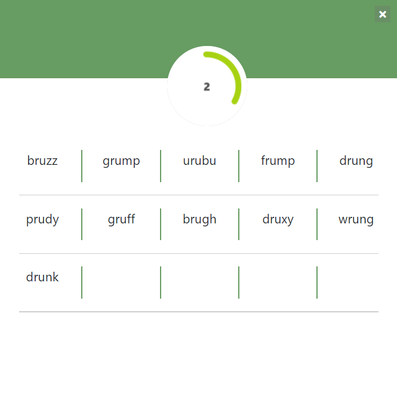

# Wordle-Extension



Wracking your brain to come up with words that fit into the [Wordle](https://www.powerlanguage.co.uk/wordle/ "Wordle") clues? Use this extension to get word suggestions and pick the most likely one to become a Wordle maestro!

## Using the extension

#### Clone the repo on your local

```
git clone https://github.com/ishawaghulde/Wordle-Solver-Extension.git
```

#### Load the directory as an unpacked extension

Open the Chrome Extension Management page. Click on the load unpacked button and select the clones directory. Make sure developer mode is enabled.

#### Get suggestions

Head over to the Wordle webpage and start playing!
Whenever in need of suggestions, open the extension list and click on the wordle extension.
You can also pin the extension for easy access.

## Found a Bug?

Feel free to raise an issue!
